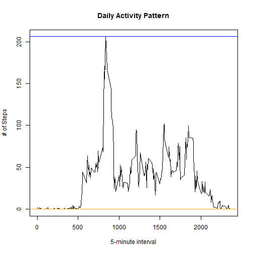

## Loading and preprocessing the data

```r
path <- getwd()
unzip(zipfile="activity.zip")
df <- read.csv(file.path(path, "activity.csv"),
               na.strings="NA")
df$date <- as.Date(df$date,"%Y-%m-%d")
```

## What is mean total number of steps taken per day?

```r
library(dplyr)
dates <- group_by(df, date)
df1 <- summarise(dates, steps=sum(steps,na.rm=T))
```

```
## `summarise()` ungrouping output (override with `.groups` argument)
```

```r
hist(df1$steps, breaks=10,main="Distribution of Daily Steps", xlab="# of Steps")
mean(df1$steps)
```

```
## [1] 9354.23
```

```r
median(df1$steps)
```

```
## [1] 10395
```

```r
abline(v=mean(df1$steps), col="blue")
abline(v=median(df1$steps), col="orange")
```


### Mean total number of steps per day is 9,354.23

### Median total number of steps per day is 10,395

## What is the average daily activity pattern?

```r
intervals <- group_by(df, interval)
df2 <- summarise(intervals, steps=mean(steps,na.rm=T))
```

```
## `summarise()` ungrouping output (override with `.groups` argument)
```

```r
plot(df2$interval,df2$steps, type="l",
     main="Daily Activity Pattern",
     xlab="5-minute interval", ylab="# of Steps")
df2[df2$steps==max(df2$steps),]
```

```
## # A tibble: 1 x 2
##   interval steps
##      <int> <dbl>
## 1      835  206.
```

```r
abline(h=max(df2$steps), col="blue")
abline(h=min(df2$steps), col="orange")
```



### At 835th interval and 206 steps were taken on average 

## Imputing missing values

### the total number of missing values in the dataset

```r
sum(is.na(df$steps))
```

```
## [1] 2304
```

### The strategy here is to impute 5-minute interaval mean to the missing values

```r
df_filled <- df
df_filled$steps[is.na(df_filled$steps)] = mean(df_filled$steps,na.rm=T)
```

### histogram of the total # of steps taken each day

```r
dates_filled <- group_by(df_filled, date)
df1_filled <- summarise(dates_filled, steps=sum(steps))
```

```
## `summarise()` ungrouping output (override with `.groups` argument)
```

```r
hist(df1_filled$steps, breaks=10,main="Distribution of Daily Steps", xlab="# of Steps")
```


### Mean and median of the new dataset

```r
mean(df1_filled$steps)
```

```
## [1] 10766.19
```

```r
median(df1_filled$steps)
```

```
## [1] 10766.19
```

#### The mean and median are the same

### Compare the original and new datasets

```r
par(mfcol=c(2,1), mar=c(2,2,2,2))
hist(df1$steps, breaks=10,main="Distribution of Daily Steps [Original]", xlab="# of Steps")
abline(v=mean(df1$steps), col="blue")
abline(v=median(df1$steps), col="orange")

hist(df1_filled$steps, breaks=10,main="Distribution of Daily Steps [New]", xlab="# of Steps")
abline(v=mean(df1_filled$steps),col="red")
```


## Are there differences in activity patterns between weekdays and weekends?

### Create a new column to tell weekdays/weekends

```r
weekdays <- c("Monday","Tuesday","Wednesday","Thursday","Friday")
df_filled$WDays <- factor((weekdays(df_filled$date) %in% weekdays),levels=c(FALSE,TRUE),labels=c("Weekend","Weekday"))
```

### Subset weekdays dataset and weekends dataset

```r
df_wdays <- df_filled[df_filled$WDays=="Weekday",]
df_wends <- df_filled[df_filled$WDays=="Weekend",]
```

### Create plots

```r
intervals1 <- group_by(df_wdays, interval)
df_wdays_in <- summarise(intervals1, steps=mean(steps))
```

```
## `summarise()` ungrouping output (override with `.groups` argument)
```

```r
intervals2 <- group_by(df_wends, interval)
df_wends_in <- summarise(intervals2, steps=mean(steps))
```

```
## `summarise()` ungrouping output (override with `.groups` argument)
```

```r
par(mfcol=c(2,1), mar=c(2,2,2,2))

plot(df_wdays_in$interval,df_wdays_in$steps, type="l", main="Weekdays Activity Pattern",  xlab="5-minute interval", ylab="# of Steps")

plot(df_wends_in$interval,df_wends_in$steps, type="l",
     main="Weekends Activity Pattern",
     xlab="5-minute interval", ylab="# of Steps")
```


